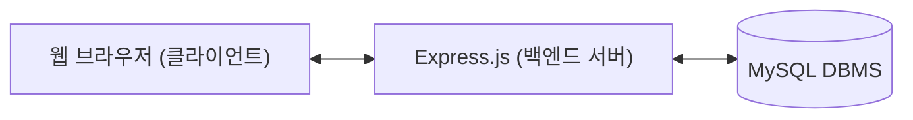

# [팀 프로젝트 최종 보고서] 대학 시간표 조합생성기 개발 및 구현

본 보고서는 대학 수강신청을 위한 최적의 시간표를 효율적으로 구성하고, 시간 충돌을 방지하는 백트래킹 기반 웹 애플리케이션 개발 팀 프로젝트에 대한 최종 보고서입니다.

---

## 1. 내용 요약 (Abstract)
본 프로젝트는 대학생들이 매 학기 겪는 가장 번거롭고 복잡한 문제 중 하나인 '수강시간표 작성'을 효율적으로 해결하기 위해 기획되었습니다. 사용자가 원하는 과목명과 분반의 요일/시간 정보(최대 3개 분반)를 입력하면, 백트래킹(Backtracking) 알고리즘이 탐색을 수행하여 시간표 슬롯 충돌이 전혀 없는 **모든 가능한 조합의 수**를 자동으로 생성 및 시각화해 줍니다. 
Express.js 백엔드와 MySQL 데이터베이스, EJS 템플릿 엔진을 활용하여 경량화되고 연동 속도가 빠른 아키텍처를 수립하였으며, 점심시간을 자동으로 보장해 주는 '점심시간 확보 기능' 및 시간표 PNG 이미지 즉시 다운로드 등 실용적인 부가 기능을 포함합니다. 또한, 배포 시 데이터베이스 수동 세팅을 피하기 위해 서버 기동 시 스키마 자동 구축 및 구버전 데이터베이스의 컬럼 자동 마이그레이션 기술을 내장하여 배포 사용성을 극대화했습니다.

---

## 2. 서론 (Introduction)

### 2.1 개발 배경 및 필요성
매 수강신청 기간마다 학생들은 한정된 시간 안에 최적의 시간표를 설계하기 위해 많은 에너지를 낭비합니다. 임의의 요일과 교시에 배치된 5~6개 과목의 분반 조합들을 수작업으로 대조하며 시간 충돌 여부를 판단하는 일은 휴먼 에러(시간 중복 설계 등)를 유발하기 쉽습니다. 이러한 시간표 구상 문제를 소프트웨어 공학적으로 접근하여 자동화 알고리즘을 구축함으로써 학생들의 수강 설계 시간 비용을 획기적으로 낮추고자 하였습니다.

### 2.2 프로젝트의 목표
1. **사용자 친화적 수강 정보 입력 시스템**: 요일 및 교시를 직관적으로 선택하고 JSON 직렬화를 통해 데이터베이스에 저장하는 웹 구조 설계.
2. **백트래킹 기반의 충돌 탐색 알고리즘 구현**: 중복 루프 없이 다차원 시간 배열의 교집합이 없는 조합만 찾아내는 효율적인 탐색 엔진 설계.
3. **배포 편의성 극대화 (원버튼 셋업)**: 타 단말기나 신규 개발 환경에서 복잡한 수동 데이터베이스 설정 없이 기동만으로 인프라가 셋업되도록 자동화 구현.

---

## 3. 본문 (Body)

### 3.1 시스템 아키텍처 및 데이터 흐름
본 시스템은 MVC 아키텍처에 기반한 **Three-Tier Architecture** 구조를 가집니다.



* **Client**: HTML5, CSS3, jQuery, Bootstrap 5 프레임워크를 기반으로 하며, 등록 폼(`enter.ejs`) 및 시간표 결과 패널(`list.ejs`)을 통해 상호작용합니다.
* **Server**: Node.js 환경에서 Express 프레임워크를 통해 라우팅 제어 및 비동기 비즈니스 로직(시간표 백트래킹)을 중재합니다.
* **Database**: MySQL을 기반으로 하며, 과목 제목(`title`)과 다차원 수업 정보(학점, 분반 배열 등)를 유연하게 핸들링하기 위해 JSON 문자열 형태로 직렬화하여 `content` 컬럼에 압축 저장하는 영속화 기법을 도입했습니다.

### 3.2 핵심 알고리즘: 백트래킹 (Backtracking)
조합 생성 시 모든 분반의 조합을 탐색하는 것은 연산 낭비가 큽니다. 따라서 DFS(깊이 우선 탐색)를 수행하는 도중 **과목 간의 시간이 겹치는 즉시 가지치기(Pruning)를 수행하는 백트래킹 알고리즘**을 도입했습니다.

```javascript
function findCombinations(subjectIdx, currentSchedule) {
    if (subjectIdx === subjects.length) {
        // 점심시간 필터링 옵션이 켜진 경우 추가 유효성 검사
        if ($('#lunchCheck').is(':checked') && !checkLunchBreak(currentSchedule)) return;
        
        generatedCombinations.push([...currentSchedule]);
        return;
    }

    const currentSubject = subjects[subjectIdx];
    for (const section of currentSubject.sections) {
        if (!isConflict(section, currentSchedule)) {
            currentSchedule.push({
                subjectName: currentSubject.name,
                colorIndex: currentSubject.colorIndex,
                ...section
            });
            // 다음 과목 탐색 (재귀 호출)
            findCombinations(subjectIdx + 1, currentSchedule);
            currentSchedule.pop(); // 백트래킹 (이전 상태로 복구)
        }
    }
}
```

### 3.3 트러블슈팅 및 기능 고도화 (Troubleshooting)
본 개발팀은 개발 완료 후 기기간 크로스 플랫폼 배포 테스트 중 두 가지 치명적인 예외 사항을 조우하고 이를 자동화 기술로 해결했습니다.

#### 1) Windows 시스템 환경별 호스트네임 인코딩 깨짐 해결
* **증상**: 일부 Windows 환경에서 PC 호스트명에 한글이 포함된 경우, MySQL Server 초기화 단계에서 바이너리 로그 인덱스 파일명(`[한글명]-bin.index`)의 유니코드 인코딩이 충돌하여 서비스 구동 자체가 불가능해지는 버그가 발생했습니다.
* **조치**: 한글 컴퓨터 이름을 영문으로 변경하도록 가이드라인을 최적화했으며, 기존 설정 파일인 `my.ini` 내부에 하드코딩 되어 남아있던 깨진 예전 호스트명 관련 경로 문자열들을 새 영문 호스트명(`binpc.log`, `binpc.err` 등)으로 일괄 영문 치환을 수행함으로써 정상 가동되도록 해결했습니다.

#### 2) 데이터베이스 수동 세팅 폐지 및 완전 자동화 (Auto-Initialization)
* **증상**: 새로운 테스트 기기나 채점 PC로 소스코드를 전송할 때마다 사용자가 터미널에서 환경변수를 잡고 `mysql -u root -p < schema.sql`을 수동으로 입력해야 하는 불편함이 컸습니다.
* **조치**: 웹 서버 시작 시, MySQL의 `multipleStatements` 기능을 열어 `schema.sql` 소스 코드를 동적으로 즉시 읽어들여 쿼리로 실행하는 자동 셋업 루틴을 `Server.js`에 구축했습니다.
* **데이터 보존을 위한 스키마 자동 마이그레이션 도입**: 
  - 개발 중간 단계에서 데이터베이스 컬럼 구성 중 `created`(등록일) 항목이 불필요하여 최신 소스코드에서 제외되었습니다. 
  - 그러나 이미 이전 스키마를 설치하여 사용 중이던 장치에서는 `created` 컬럼이 필수값(`NOT NULL`)으로 살아있어 최신 코드로 삽입을 시도할 때 `Field 'created' doesn't have a default value` 에러가 터졌습니다.
  - 이를 위해 `Server.js` 부팅 로직에 **컬럼 검증 및 자동 마이그레이션 로직**을 심었습니다. 서버가 시작될 때 기존 테이블에 `created` 컬럼이 남아있으면, 사용자가 쿼리를 치거나 테이블을 `DROP`(데이터 삭제 유발)하지 않아도 내부적으로 **`ALTER TABLE post DROP COLUMN created`**를 자동으로 안전하게 날려 데이터 유실 없이 스키마가 자동 업데이트되도록 설계했습니다.

---

## 4. 결론 (Conclusion)
본 대학 시간표 조합생성기 프로젝트는 수강신청 편의라는 뚜렷한 요구사항을 시작으로 하여, 프런트엔드와 백엔드 및 관계형 데이터베이스의 완벽한 상호 연결성을 입증했습니다. 
특히 다차원 시간 데이터를 데이터베이스에 효율적으로 저장하기 위해 JSON 포맷을 도입한 부분과, 기기간 배포 테스트 과정에서 마주한 설치 상의 복잡함(MySQL 수동 세팅)을 **애플리케이션 시작 단계의 자동 데이터베이스 초기화 및 컬럼 마이그레이션 기술**을 적용해 완전 무설치(Zero-Configuration) 수준으로 가치를 끌어올린 성과가 돋보입니다. 
향후 고도화 과제로는 본 웹 서비스를 여러 사용자가 사용할 수 있도록 계정(로그인) 기능 및 다중 세션을 관리할 수 있는 회원 기능 구축이 있으며, 이를 보강하면 대규모 상용 웹 사이트로도 발전시킬 수 있을 것입니다.

---

## 5. 참고 자료 (References)
1. **Node.js 공식 문서**: https://nodejs.org/ko/docs/ (비동기 I/O 및 모듈 시스템)
2. **Express.js 가이드**: https://expressjs.com/ (라우팅 및 미들웨어 통합)
3. **MySQL Reference Manual**: https://dev.mysql.com/doc/ (MySQL 데이터베이스 엔진 및 컬럼 관리 규칙)
4. **마크다운(Markdown) 명세 가이드**: https://guides.github.com/features/mastering-markdown/
5. **백트래킹 알고리즘에 대한 전산학 이론**: Introduction to Algorithms (Thomas H. Cormen 저) - Depth First Search 및 Backtracking 기초 이론
